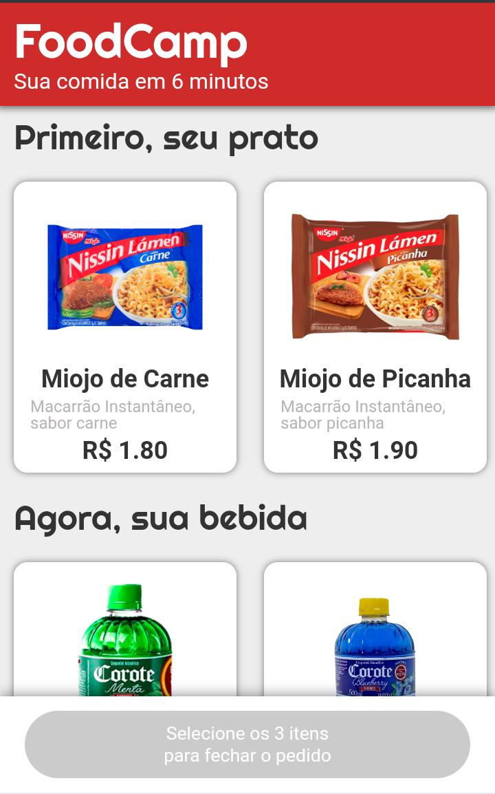
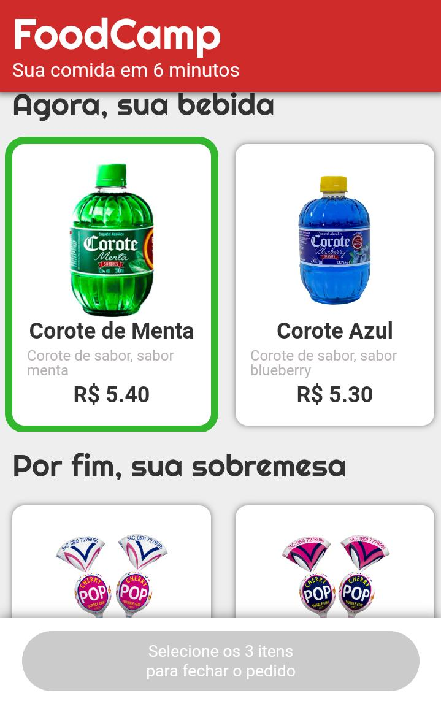
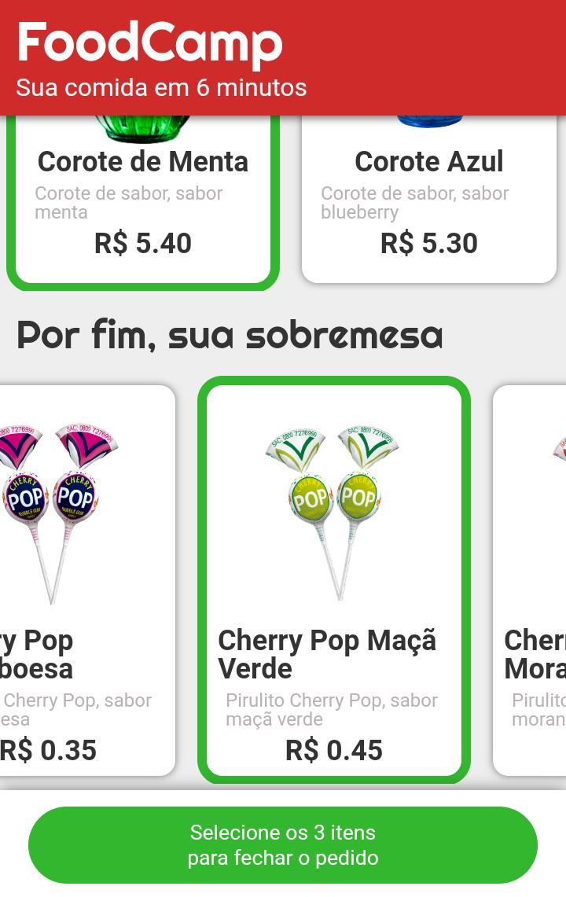
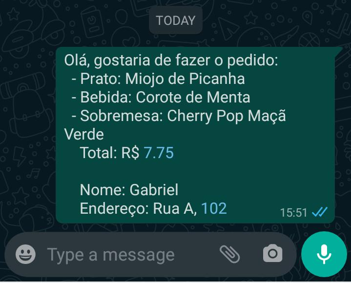

# FoodCamp

FoodCamp, um site com layout mobile desenvolvido com HTML5, CSS e JS para um restaurante especial que entrega seu pedido em 6 minutos. Escolha seu pedido e envie diretamente para o WhatsApp do restaurante

DEMO: https://barrosg99.github.io/food-camp/

## Features

✅ Escolher Comida, Bebida e Sobremesa

✅ Enviar pedido diretamente para o WhatsApp com mensagem gerada automaticamente baseado no pedido

## Como rodar o projeto?

1. Clone o projeto
2. Abra o index.html com o navegador
